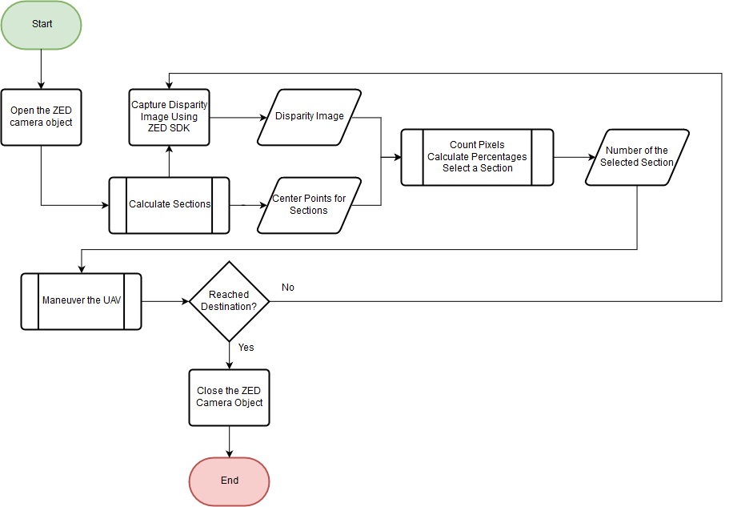
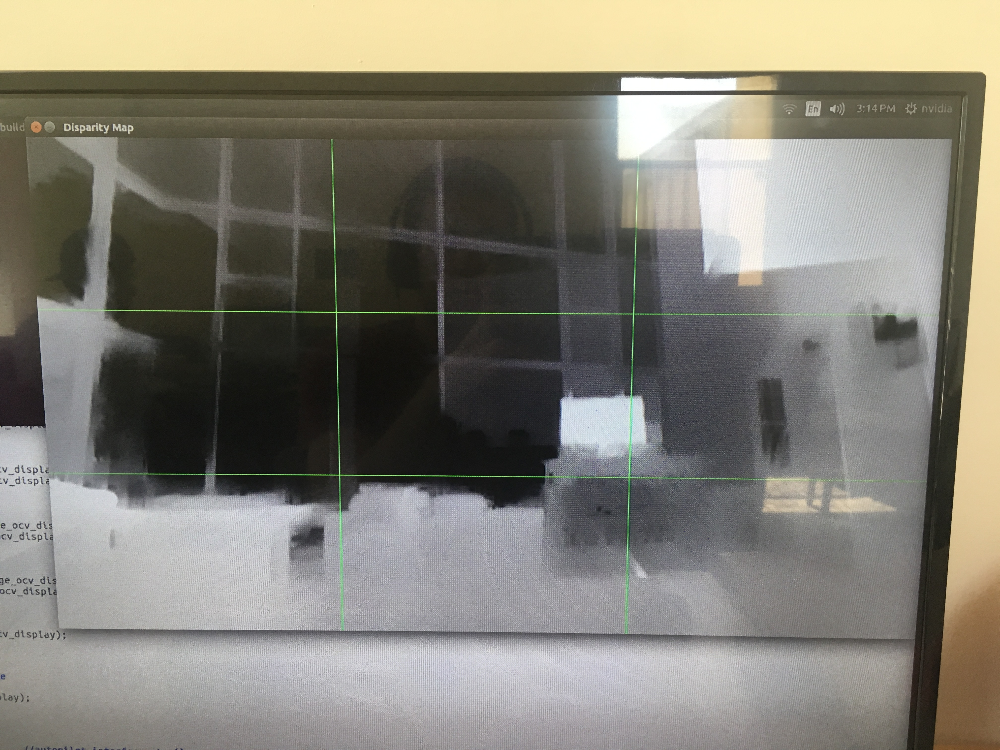
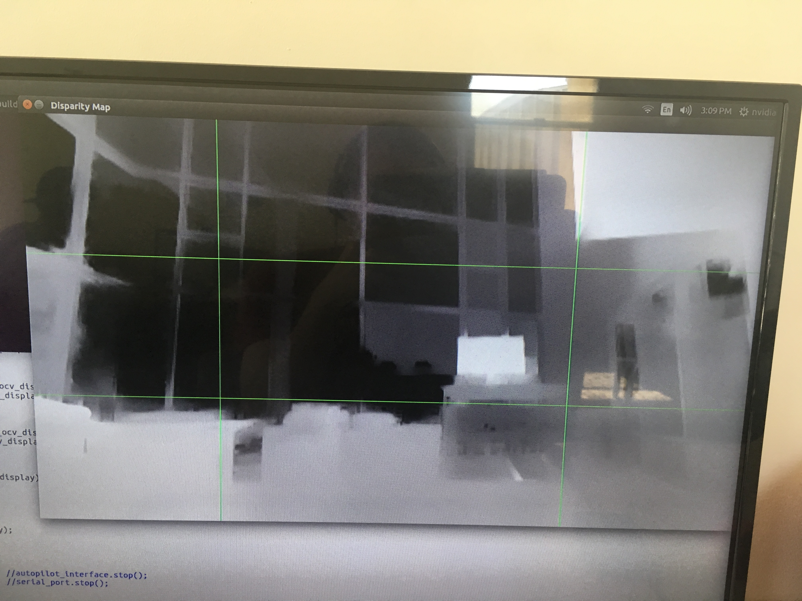
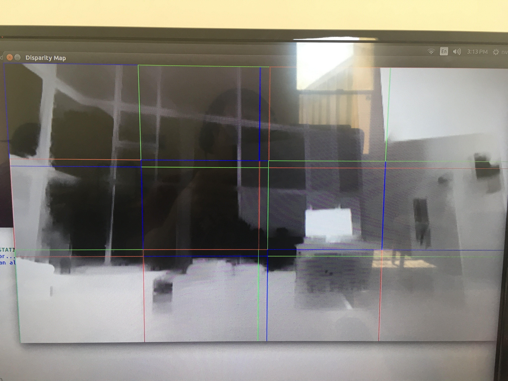
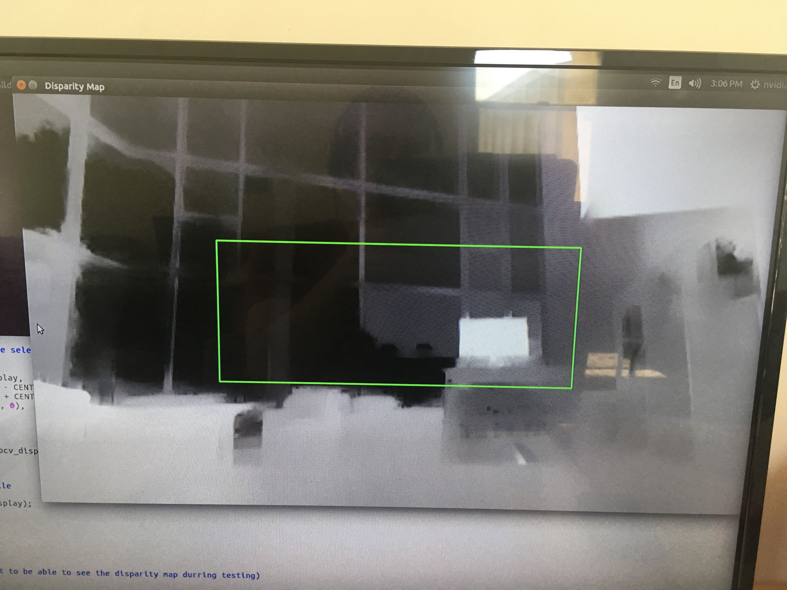
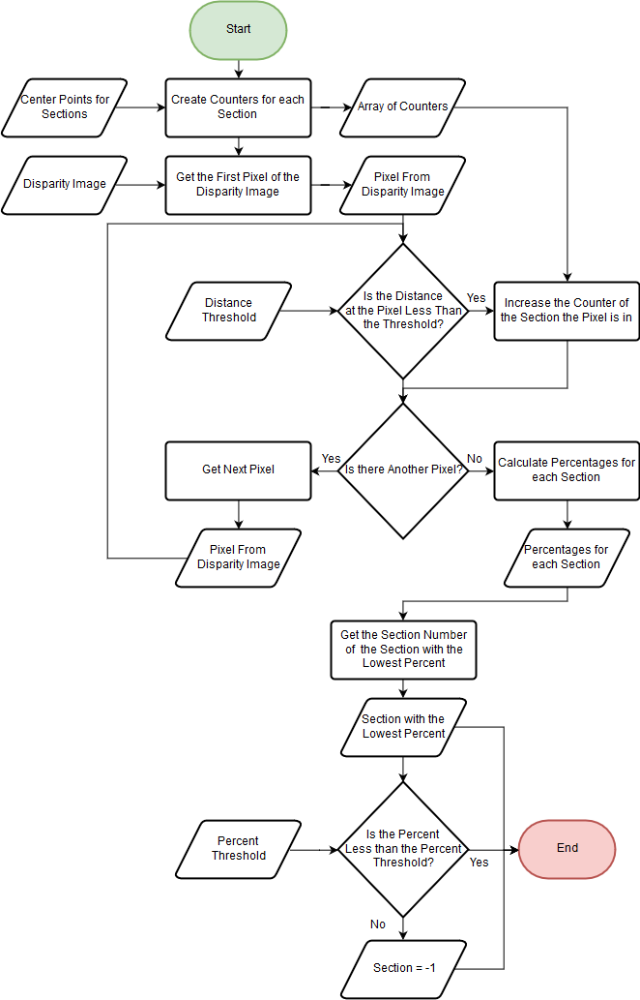
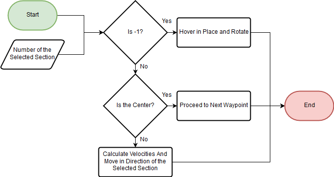

# Obstacle Avoidance Using Stereo Vision

## Introduction
This document gives an overview of our process for performing obstacle avoidance for unmanned air vehicles using stereoscopic vision. The preceeding sections discuss the steps that the code will execute ([Overall Process](https://github.com/Wingman-19/CPP_UAV_Stereo_Vision/blob/master/README.md#overall-process)) as well as the differnet algorithms designed for partitioning the disparity image ([Partitioning Algorithms](https://github.com/Wingman-19/CPP_UAV_Stereo_Vision/blob/master/README.md#partitioning-algorithms)) determining how to avoid an obstacle ([Section Selection](https://github.com/Wingman-19/CPP_UAV_Stereo_Vision/blob/master/README.md#section-selection) and [Movements](https://github.com/Wingman-19/CPP_UAV_Stereo_Vision/blob/master/README.md#movements)). There are sections for terminology ([Terms](https://github.com/Wingman-19/CPP_UAV_Stereo_Vision/blob/master/README.md#terms)) and links to the papers and references that we used throughout the process ([Links / Papers](https://github.com/Wingman-19/CPP_UAV_Stereo_Vision/blob/master/README.md#links--papers))

## Requirements
  * Avoid static obstacles using a stereoscopic camera while moving from point A to point B
  * Avoid moving obstacles using a stereoscopic camera while moving from point A to point B
  * Detect collisions within 4 seconds of the collision
    * Give time for the UAV to gather data and make a decision on how to avoid the collision

## Overall Process
  1. Open the zed camera
      * Set the parameters here as well
  2. Create the disparity image
      * Using the ZED SDK this is really easy to do
  3. Partition the disparity image into sections
      * Keep track of the starting point for each section (Both horizontally and vertically)
      * Discussed in more detail in the [Partitioning Algorithms](https://github.com/Wingman-19/CPP_UAV_Stereo_Vision/blob/master/README.md#partitioning-algorithms) section
  4. Count the number of pixels in each section that have a value closer than a given threshold
      * Calculate the percentage for each section
  5. Select the section that has the lowest percentage
      * The section that is selected must have a percentage less than a specified percentage threshold or it will not be selected
      * Discussed in more detail in the [Section Selection](https://github.com/Wingman-19/CPP_UAV_Stereo_Vision/blob/master/README.md#section-selection) section
  6. Move in the direction of the selected section
      * Discussed in more detail in the [Movements](https://github.com/Wingman-19/CPP_UAV_Stereo_Vision/blob/master/README.md#movements) section
  7. Repeat until the destination is reached
  8. Close the camera
  
  

## Partitioning Algorithms
  1. **Basic Nine Sections**
      * The first partitioning algorithm we created was where the disparity image was sectioned off into nine equal area sections that do not overlap each other. We feel that the reason this process is not the most efficient is that the center section is not large enough to see objects that might be to the sides of the UAV. There may be obstacles that are right on the edge of the center section that are not counted because they are in a different section. This would mean that eventhough the camera sees the center as open, the UAV will still hit an obstacle. The code for this can be seen [here](https://github.com/Wingman-19/CPP_UAV_Stereo_Vision/blob/master/Solutions/smallEven.cpp).
      * Example Disparity Image Using this Method: 
  
  2. **Large Center Nine Sections**
      * The next possible solution that we created was to section off the disparity image so that there are still nine sections but instead of them all being equal, the center section is larger and the outside sections are smaller. We made the center section to be large enough so that the region it encompasses is large enough so the UAV can fly through it. This caused the problem of figuring out what percentage of each section needs to be seen as an obstacle for it to be determined as non-traversable. Because the center section was larger, the percentage threshold for it needed to be lower than that of a smaller section. The code for this solution can be seen [here](https://github.com/Wingman-19/CPP_UAV_Stereo_Vision/blob/master/Solutions/centerLarge.cpp).
      * Example Disparity Image Using this Method: 
  
  3. **Nine Large Sections**
      * To fix the issue of each section having a different threshold percentage, we decided to partition the disparity image using nine equal section that are the size of the center section discussed in the previous solution. This solution was unique to the first two in the fact that the sections now overlap each other a little. This solution allows for each section to have the same percentage threshold and for the section that is selected to be large enough to encompass an area that the UAV can fly through. We found through ground testing that this solution was the most accurate in determining an appropriate section to select. The code for this can be seen [here](https://github.com/Wingman-19/CPP_UAV_Stereo_Vision/blob/master/Solutions/largeEven.cpp), or by changing the NUM_RECT constant to 3 in the code [here](https://github.com/Wingman-19/CPP_UAV_Stereo_Vision/blob/master/Solutions/multipleOverlap.cpp).
      * Example Disparity Image Using this Method: 
  
  4. **Overlapping Large Sections**
      * We wanted to create a way for there to be multiple sections to choose from so that the UAV will fly smoother and find a path avoiding obstacles more often. With the previous methods, the UAV would only 9 different sections to choose from, therefore limiting the possible sections that can be used to avoid obstacles. The solution to this was to create more sections (all of the larger size created in the Large Center Nine Sections solution) and have them overlapping even more. This will allow the UAV to select sections that was not capable of selecting before. An example of how this might be useful is when using the Nine Large Sections method, if the top left corner has a percentage value of 50% (that being all in the left half of the section) and the top middle section also has a percentage value of 50% (that being all in the right half of the section) then the UAV would not select either of these sections. Now if we added a section in the middle of these two sections, the percentage value would be 0% (if would be the made of the right half of the first section and the left half of the second section which are both clear of obstacles). The UAV will select this new section and now will have a path to traverse across. In addition, this code selects the section with the lowest percentage value and if there are multiple sections with the same value it selects the section that is closest to the center. The code for this can be seen [here](https://github.com/Wingman-19/CPP_UAV_Stereo_Vision/blob/master/Solutions/multipleOverlap.cpp) and the number of sections can be modified by changing the NUM_RECT constant.
      * Example Disparity Image Using this Method: 

## Section Selection
  1. A depth threshold is determined at the start (must allow the UAV to detect and avoid an obstacle within 4 seconds of the collision. The values are currently smaller for testing purposes in enclosed areas)
  2. A threshold for the percentage of pixels that can be closer than the depth threshold is determined at the start (15% - 20% for now)
  3. The pixels in each section that have a depth that is closer than the depth threshold are counted
  4. The percentage for each section is calculated
  5. A section is determined by selecting the section with the smallest percentage
      * If this section has a percentage higher than the percentage threshold, then it is not selected and a default section is selected (More information on how the UAV moves in this situation in the [Movements](https://github.com/Wingman-19/CPP_UAV_Stereo_Vision/blob/master/README.md#movements) section)

  

## Movements
  * The sections will be numbered starting with 0 and with the top left corner
    * A section value of -1 represents the default section
  * The center of the selected section is found
    * If the default section is selected, the center is set to (0, 0)
    * Using the center point of the selected section and the center of the overall image, the angle that the UAV will fly to avoid the obstacle is determined
    * Using this angle, the velocities along the y-axis and z-axis are determined (Note that we are using the local NED frame)
    * These commands are sent to the Pixhawk through the use of MAVLink commands (Discussed in more detail in the [Mavlink](https://github.com/Wingman-19/CPP_UAV_Stereo_Vision/blob/master/README.md#mavlink) section)
    
  
    
## MAVLink
  * Through the use of the [c_uart_interface_example](https://github.com/mavlink/c_uart_interface_example) and the files included in the example, we are able to send commands to be able to change the velocity of the UAV
  * The Serial_Port class is used for connecting to the Pixhawk and reading and writing the MAVLink messages
  * The Autopilot_Interface is user to create the messages and prepare the information to be sent and received from the Pixhawk
    
## Required Installations to use the Jetson TX1 and the ZED Camera
  * **JetPack**: JetPack is used to flash the Jetson TX1 and add libraries like CUDA and VisionWorks (We are using JetPack 3.0)
    * Information about JetPack can be found [here](https://developer.nvidia.com/embedded/jetpack-notes)
  * **ZED SDK for Jetson TX1**: The ZED SDK is used to be able to capture the disparity images and run programs like the ZED Depth Viewer and ZED Explorer
    * The ZED SDK can be downloaded [here](https://www.stereolabs.com/developers/release/2.0/#sdkdownloads_anchor)
    
## JetPack Installation Issues and Solutions
  * The installation guide that we followed can be found [here](http://docs.nvidia.com/jetpack-l4t/index.html#developertools/mobile/jetpack/l4t/3.0/jetpack_l4t_install.htm)
  * JetPack must be run on a 64 bit host machine that is running Ubuntu 14.04 so that the Jetson can be flashed
    * We used a virtual machine that ran Ubuntu 14.04
  * When flashing the Jetson TX1, there are two options for the Network Layouts
    * At first, we attempted to use the second option (Device get IP assigned by DHCP server on host and access Internet via host machine) but this was running into issues where the connection to the host was being refused
      * All of the tutorials and documentation we found used the first option so finding a solution for this issue was difficult
    * We were able to get access to a router and ended up using the first option (Device access Internet via router/switch) to flash the Jetson TX1
      * This method was easier than the other and we ran into fewer issues
  * Another issue that we found was that when we attempted to ssh into the Jetson TX1, we were getting a connection time out error
    * This issue was solved when we logged out of the Ubuntu account and logged into the Nvidia account on the Jetson TX1
    * We are not sure why exactly this worked, but we were able to immediately ssh into the Jetson and therefore download and install all of the post installation libraries
    
## Terms
  * **Disparity Map**: When two images are taken from slightly different locations, the objects in the image appear to shift. This apparent shifting (or difference in pixel positions) between the two images is called disparity. The disparity between the two images creates the disparity map.
  * **SSH**: SSH is also known as Secure Socket Shell. It is a protocol that provides an administrator with a secure way of remote accessing another computer.

## Links / Papers
  * [Stereoscopic Vision Papers](https://github.com/Wingman-19/CPP_UAV_Stereo_Vision/tree/master/Stereo%20Vision%20Papers)
  * [Comparative Presentation of Real-Time Obstacle Avoidance Algorithms Using Solely Stereo Vision](http://83.212.134.96/robotics/wp-content/uploads/2011/12/Comparative-Presentation-of-Real-Time-Obstacle-Avoidance_Kos.pdf)
  * [Stereo vision obstacle avoidance using depth and elevation maps](https://robotica.dc.uba.ar/wp-content/papercite-data/pdf/pire2012.pdf)
  * [JetPack Installation for the Jetson TX1](http://docs.nvidia.com/jetpack-l4t/index.html#developertools/mobile/jetpack/l4t/3.0/jetpack_l4t_install.htm)
  * [JetPack 3.0 Release Notes](https://developer.nvidia.com/embedded/jetpack-notes)
  * [ZED SDK Download](https://www.stereolabs.com/developers/release/2.0/#sdkdownloads_anchor)
  * [ZED API Documentation](https://www.stereolabs.com/developers/documentation/API/annotated.html)
  * [Included MAVLink Library](https://github.com/mavlink/c_library_v2)
